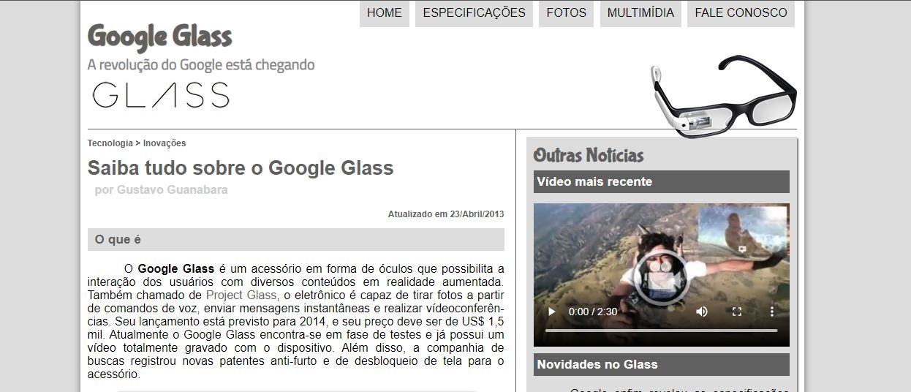
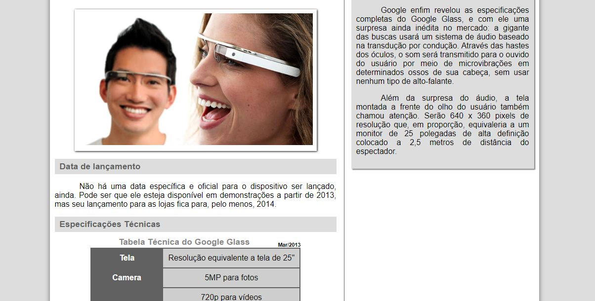
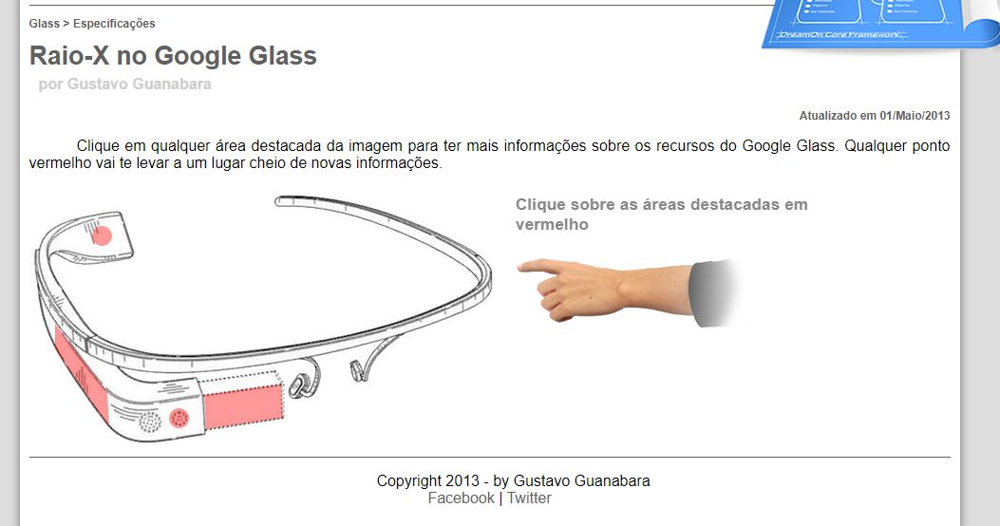
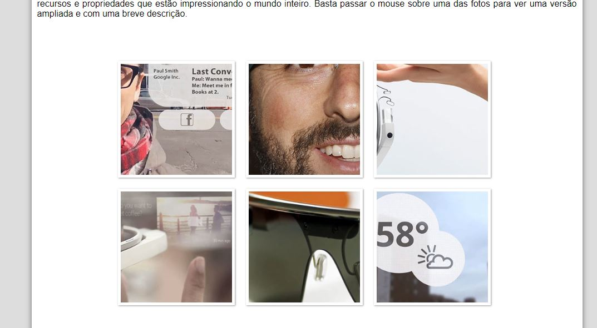
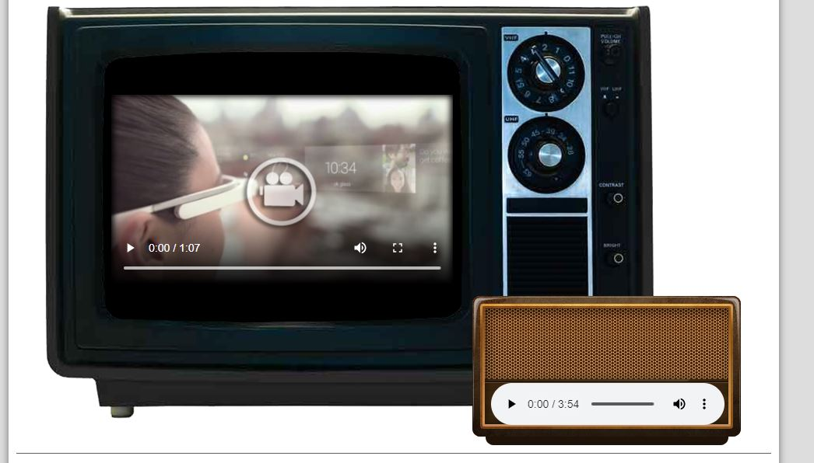
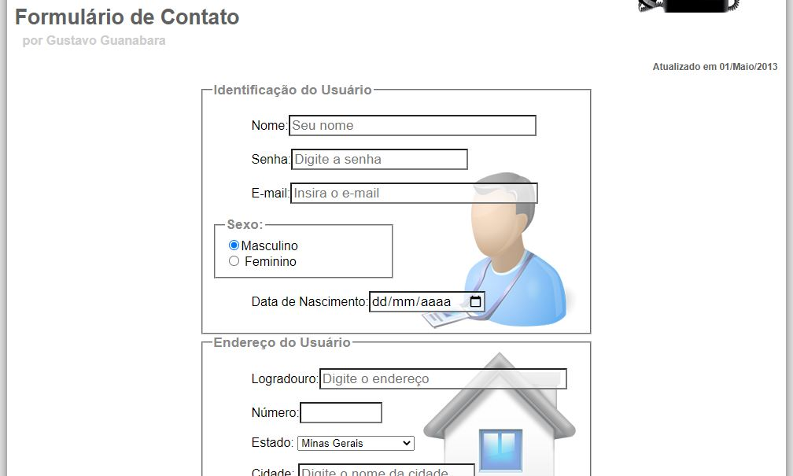
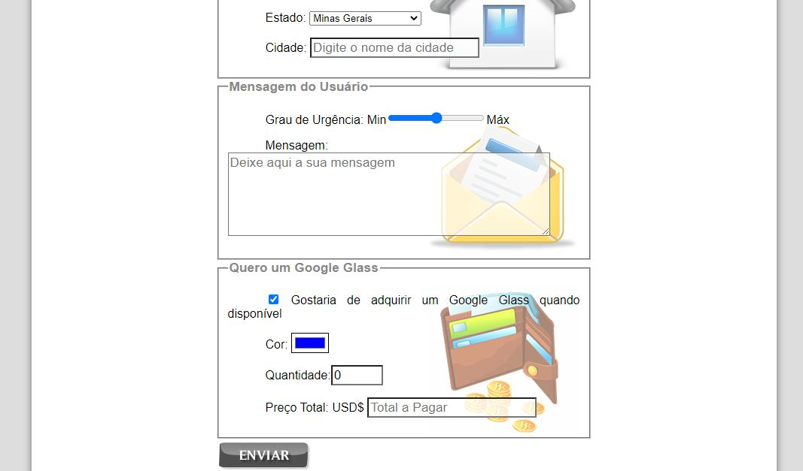

<h3>Exercício do curso "HTML5" da plataforma "Curso em Vídeo"</h3>

<h1>"Projeto Google Glass"</h1>

  <h3><a href="https://euphonious-otter-aa34cd.netlify.app">Clique aqui para ir ao site</a></h3>
  
obs: Site hospetado através do Netfily apenas para fins de demonstração. A perfomance pode não ser das melhores

<h2>Capturas de Tela do Projeto</h2>

  
Cabeçalho

  
  
Página Home

  
  
Página de Especificações

  
  
Galeria de Fotos

  
  
Página com Video e Audio

  
  
Formulário

  
  

<h2>Funcionalidades</h2>
<h3>Nesta seção estão destacados partes interativas do projeto</h3>

  
Galeria de Fotos (apenas CSS)

  

  
Menu com mudança de ícone (uso-se javascript)

  

Na página de Especificações, para gerar a funcionalidade abaixo foi usado a tag iframe cuja função é exibir um documento html dentro de outro:

  

